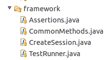

# selenium_BDD_framework

Behavioural driven development automation framework using selenium, cucumber-java, testng, maven, phantomjs

**Tools and technologies used:**

1. Language: Java 8
2. Testing framework: Testng
3. BDD framework: Cucumber jvm
4. Automation tool: Selenium webdriver
5. Build tool: maven
6. Logging: log4j
7. Headless browser: Phantomjs

Setting up the project:

$ cd selenium_BDD_framework

$ mvn clean install

Running the tests: There are 2 scenarios named as @scenario1 and @scenario2. Ran the tests on chrome54.0, firefox46 on ubuntu 14.04 64 bit

To run both scenarios (@scenario1 and @scenario2) (by default browser would be chrome):

$ mvn test

To run test with configurable browser (for firefox, use -Dbrowser=firefox)

$ mvn test -Dbrowser=chrome

To run tests headlessly

$ mvn test -Dheadless=yes

To run specific scenario:

$ mvn test -Dcucumber.options="--tags @scenario3"

To run multiple mentioned scenarios:

$ mvn test -Dcucumber.options="--tags @scenario3,@scenario2"

Features of the framework:
1. BDD framework using Cucumber-jvm. Features can be written easily using Given,When, Then etc.
2. Browser(chrome/firefox) can be configured at run time  from command line.
3. Test can run in headless browser (Phantomjs), if required.
4. Screenshot would be taken if any scenario failed and saved under /outputFiles folder.
5. Html report gets generated after each test run and can be found /target/cucumber-html-report/index.html

**package: libs :** It has exe of chromedriver and phantomjs. This is required while creating the webdriver session.

**package: features :** It contains all different features (tests) files. 

**package: framework :** It includes the common classes (and methods) which are required by each test to perform actions. Below are classes in this package:

**CreateSession.java** : All the methods to create a new session and destroy the session after the test(s) execution is over. Each test extends this class.

Package: logger : It contains Log.java class which contains methods to show the logs on console and save the logs in LogFile.txt of each run.

Logic: contains all the classes where actions and assertions happens. Also, has class to start the execution.

OutputFiles: All the output files will be stored here (screenshots/csv/txt files)

Pages: It has web elements corresponding to the specific page.

Index.html will have execution report as follows:

